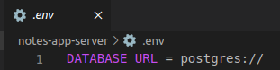
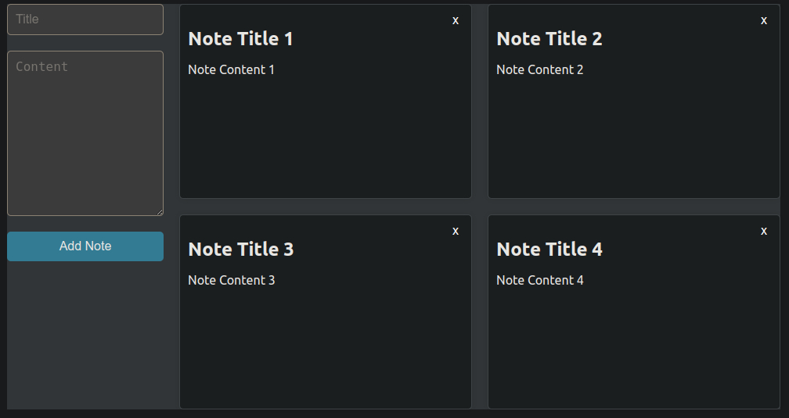
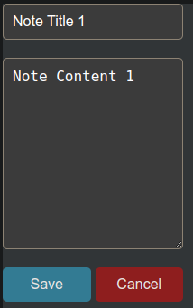
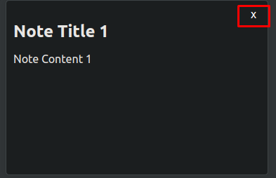

# Notes App  
Notes App is a user-friendly tool for creating and organizing notes. It provides a simple and intuitive interface for users to manage their notes efficiently. The app is built using TypeScript/JavaScript and Node.js for smooth performance, and it securely stores data in a PostgreSQL database via ElephantSQL.

## Features  
- Create new notes with titles and content.
- Edit existing notes seamlessly.
- Delete notes when they are no longer needed.
- Intuitive user interface for easy navigation and interaction.
- Backend API built with Express.js to handle CRUD operations.
- Frontend developed with React.js for dynamic and responsive user experience.

## Technologies Used  
- TypeScript/JavaScript
- Node.js
- Express.js
- React.js
- Prisma for ORM (Object-Relational Mapping)
- PostgreSQL database via ElephantSQL

## Getting Started  
To get started with the Notes App, follow these steps:  
- Clone this repository to your local machine.
- Install dependencies using npm install.
- Set up your PostgreSQL database and obtain the connection URL.
- Update the DATABASE_URL environment variable in the .env file with your database connection URL.  

- Start the backend server using npm start.
- Navigate to the frontend directory and start the React development server using npm start.
- Access the Notes App in your web browser at http://localhost:3000.

## Usage  
- Upon launching the app, you will see a list of existing notes (if any). 
- To create a new note, click on the "Add Note" button and fill in the title and content fields.  

- To edit an existing note, click on the note in the list, make the desired changes, and click "Save".  

- To delete a note, click the "x" button next to the note in the list.  

## Contributing  
Contributions to the Notes App are welcome! If you have any ideas for new features, enhancements, or bug fixes, please open an issue or submit a pull request.

## License  
This project is licensed under the MIT License.

Feel free to customize this README according to your project's specific requirements and preferences. If you need further assistance or have any questions, don't hesitate to ask!
